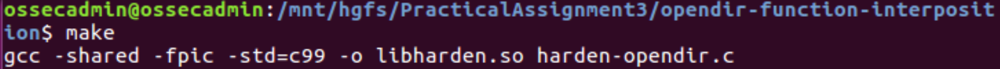
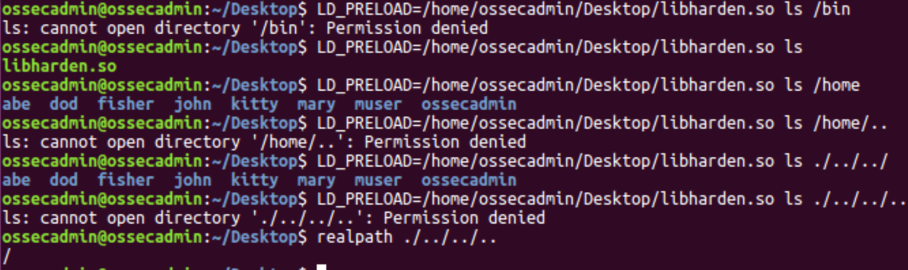
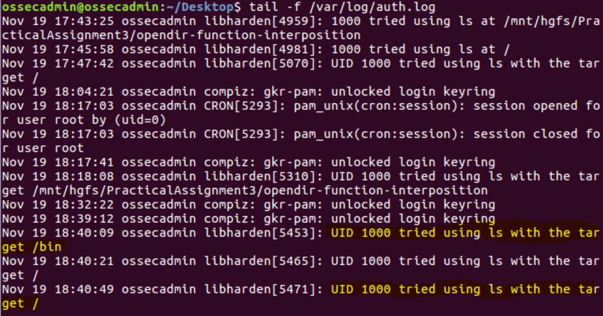

# opendir-function-interposition

## Goal

Your task is to create an interposable library with a new definition for the “opendir” function call which will be used to restrict and audit the use of the ls command. The new implementation of opendir will intercept the call to access any target directory issued by ls and then makes a decision to whether allow ls to open the directory or not based on the following conditions:

If the target path is within the /home directory, the new opendir will call the original opendir function and pass the parameter (the target directory) as expected.

If the target path is not within the /home directory, the new function will log this access as an error in the syslog and then deny access to open the target directory.

## Implementation

[harden-opendir.c](harden-opendir.c) is the source code for the function wrapper. It uses function interposition to wrap the real opendir function to add the new auditability funcitonality.

The [Makefile](Makefile) is used to compile the share object (so) that is used as a wrapper function for opendir.

Test the libharden.so by monitoring the /var/log/auth.log and running ls commands with the preloaded shared object.

## References

- http://www.cs.uky.edu/~neil/485/labs/3/
- https://jayconrod.com/posts/23/tutorial--function-interposition-in-linux
- https://man7.org/linux/man-pages/man3/getcwd.3.html
- https://www.tutorialspoint.com/c_standard_library/c_function_strncmp.htm
- https://man7.org/linux/man-pages/man3/realpath.3.html 
- https://www.gnu.org/software/libc/manual/html_node/openlog.html 
- https://man7.org/linux/man-pages/man3/dlsym.3.html 
- https://linux.die.net/man/3/dlerror 
